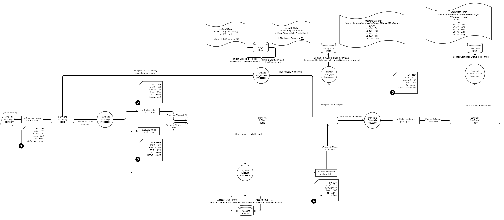

# KPay Version with Spring Boot

There is still a lot to do, but try it out and improve

## Process

## Run within your IDE

> Run java class  ch.wesr.kpay.KpayApplication 

 ## User interface and Endpoints
 - Account UI: http://localhost:8080/index.html
 - SWAGGER: http://localhost:8080/swagger-ui.html# 
 - REST: http://localhost:8080/api/listAccounts

## Requirements
* Kafka running - best run [Confluent within docker](https://docs.confluent.io/current/quickstart/ce-docker-quickstart.html)
* Install Docker
* cd in [confluent](../confluent) and run
    * docker-compose up -d
    * docker-compose down -v 
* or if you run Windows
    * up.bat
    * down.bat
 
## Inspired by and copied from

* [Original Kpay from Confluent](https://github.com/confluentinc/demo-scene/tree/master/scalable-payment-processing)
* [Journey to Event Driven 1](https://www.confluent.io/blog/journey-to-event-driven-part-1-why-event-first-thinking-changes-everything)
* [Journey to Event Driven 2](https://www.confluent.io/blog/journey-to-event-driven-part-2-programming-models-event-driven-architecture)
* [Journey to Event Driven 3](https://www.confluent.io/blog/journey-to-event-driven-part-3-affinity-between-events-streams-serverless)
* [Journey to Event Driven 4](https://www.confluent.io/blog/journey-to-event-driven-part-4-four-pillars-of-event-streaming-microservices)

And the 
*[Spring Cloud Stream Kafka Streams from @starbuxman](https://www.youtube.com/watch?v=YPDzcmqwCNo)
